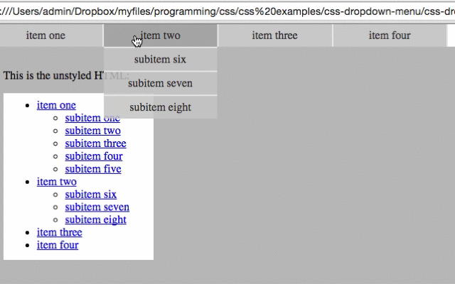

# Minimal pure CSS dropdown menu

This is a CSS-only horizontal menu with translucent vertical drop-down submenus.

It has been designed with minimal HTML and as few CSS styling hooks as possible (no excessive markup or CSS classes).

The code is commented in detail to aid understanding.

The two common issues are fixed:

- spaces that appear between `li` tags when they’re on separate lines but are styled with `display: inline-block;`
- borders you want between items but not where you *don’t* want them

This is mainly for my students (who are learning to HTML and CSS), but anyone can integrate it with an existing website.
